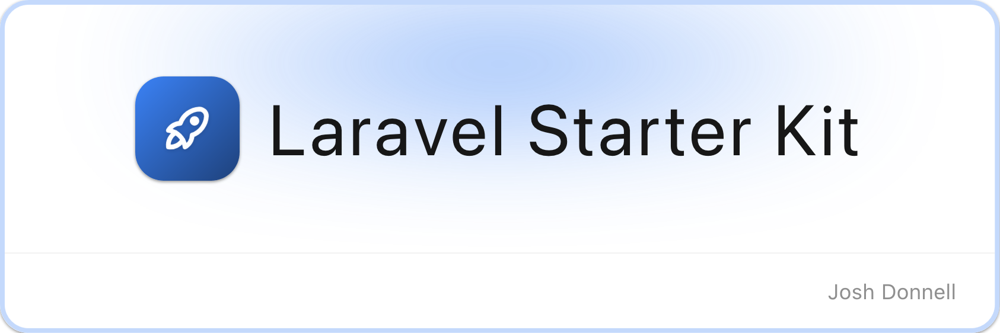

<picture>
    <source media="(prefers-color-scheme: dark)" srcset="art/header-dark.png">
    
</picture>

<br/>

<p>
    <a href="https://github.com/joshdonnell/laravel-starter-kit-vue/actions"></a>
    <a href="https://packagist.org/packages/joshdonnell/laravel-starter-kit-vue"></a>
    <a href="https://packagist.org/packages/joshdonnell/laravel-starter-kit-vue"></a>
</p>

An end-to-end type-safe Laravel 12 starter kit with auto-generated TypeScript types, Vue, and Nuxt UI for fast front-end prototyping. Built on top of [Nuno Maduro's Laravel Starter Kit (Maintained by me :)](https://github.com/nunomaduro/laravel-starter-kit-inertia-vue), this kit extends it with Wayfinder, Laravel Data, and unplugin-auto-import to provide a Nuxt-like developer experience when writing Vue code within a Laravel Inertia application.

## Tech Stack

**Backend:** PHP 8.4+, Laravel 12, Inertia.js, Spatie Laravel Data

**Frontend:** Vue 3, Nuxt UI, TypeScript

**Type Generation:** Laravel Wayfinder (auto-generated route & action types), Spatie Laravel Data (auto-generated DTO types)

**DX Tooling:** unplugin-auto-import (Nuxt-style auto imports for Vue APIs and composables)

**Code Quality:** PHPStan (level 9), Rector, Pint, ESLint, Prettier, Pest (100% coverage)

## Local Development

> **Requires [PHP 8.4+](https://php.net/releases/), [Pnpm](https://pnpm.io/), and a code coverage driver like [Xdebug](https://xdebug.org/docs/install).**

### Installation

```bash
composer create-project joshdonnell/laravel-starter-kit-vue --prefer-dist example-app
cd example-app
```

### Setup

```bash
# Install dependencies and configure the project
composer setup

# Start the development server (Laravel, queue, logs, and Vite)
composer dev
```

### Optional: Browser Testing

If you plan to use Pest's browser testing capabilities:

```bash
pnpm add playwright
pnpx playwright install
```

### Verify Installation

```bash
composer test
```

You should see 100% test coverage and all quality checks passing.

## Available Commands

### Development

- `composer dev` — Starts Laravel server, queue worker, log monitoring, and Vite dev server concurrently

### Code Quality

- `composer lint` — Runs Rector (refactoring), Pint (PHP formatting), and Prettier (JS/TS formatting)
- `composer test:lint` — Dry-run mode for CI/CD pipelines

### Testing

- `composer test:type-coverage` — Ensures 100% type coverage with Pest
- `composer test:types` — Runs PHPStan at level 9 (maximum strictness)
- `composer test:unit` — Runs Pest tests with 100% code coverage requirement
- `composer test` — Runs the complete suite (type coverage, unit tests, linting, static analysis)

### Maintenance

- `composer update:requirements` — Updates all PHP and NPM dependencies to latest versions

## Code Style

This project enforces a strict, automated code style across both PHP and JavaScript/TypeScript:

- **PHP:** Laravel Pint for formatting, Rector for automated refactoring and modernisation
- **JS/TS/Vue:** ESLint for linting, Prettier for formatting
- **Types:** 100% type coverage enforced on both PHP (PHPStan level 9) and TypeScript (strict mode)

Run `composer lint` to auto-fix formatting across the entire codebase.

## Code Standards

- **Actions-Oriented Architecture:** Every operation is encapsulated in a single-action class
- **Cruddy by Design:** Standardised CRUD operations for all controllers, actions, and Inertia pages
- **Immutable-First:** Data structures favour immutability to prevent unexpected mutations
- **Fail-Fast:** Errors are caught at compile-time through strict static analysis, not at runtime
- **Strict Laravel Defaults:** Strict models, auto eager loading, immutable dates via [Essentials](https://github.com/nunomaduro/essentials)
- **AI Guidelines:** Integrated AI guidelines to assist in maintaining code quality and consistency

## Testing

The project uses [Pest](https://pestphp.com) with a full testing suite of 150+ tests. The following standards are enforced:

- **100% code coverage** — the test suite will fail if coverage drops below 100%
- **100% type coverage** — every method, property, and parameter must be explicitly typed
- **Static analysis** — PHPStan at level 9 (maximum strictness)

Run the full suite with:

```bash
composer test
```

Or run individual checks:

```bash
composer test:unit            # Unit & feature tests
composer test:types           # PHPStan static analysis
composer test:type-coverage   # Type coverage check
composer test:lint            # Linting dry-run
```

## Contributing

Contributions are welcome from everyone! To get started:

1. Fork the repository
2. Create a feature branch (`git checkout -b feat/my-feature` or `git checkout -b fix/my-fix`)
3. Make your changes
4. Ensure CI is passing (`composer test`)
5. Commit your changes (`git commit -m 'Add my feature'`)
6. Push to your branch (`git push origin feat/my-feature`)
7. Open a Pull Request

Please ensure all tests and quality checks pass before submitting your PR.

## License

This project was created by **[Josh Donnell](https://x.com/developedbyjosh)** under the **[MIT license](https://opensource.org/licenses/MIT)**.
